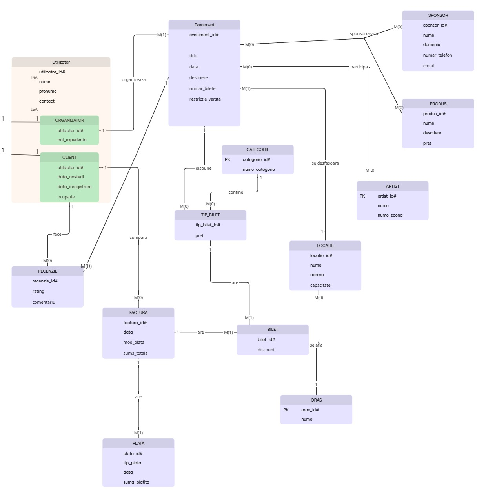
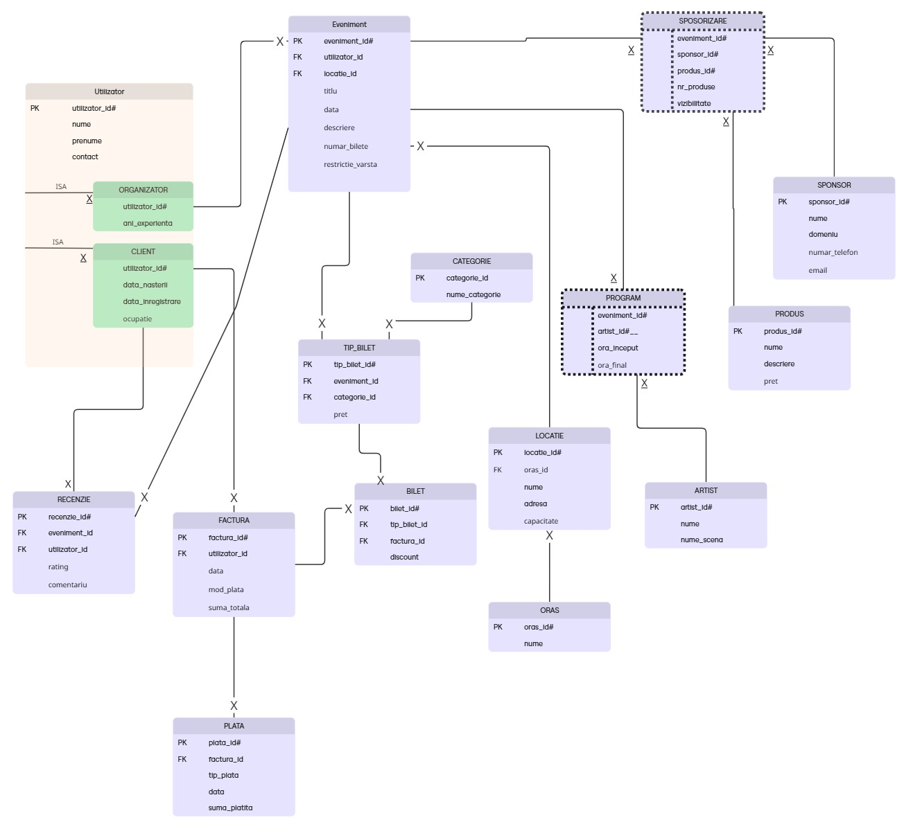

# Event-Management-Database-Oracle-PL-SQL
An Oracle database project exploring SQL, PL/SQL, database design, triggers, cursors, collections, and stored programs.

The database models the activity of an event management system, integrating:

- **event management** – events, locations, schedules and artists;
- **ticket management** – ticket categories, ticket types, tickets and invoices;
- **user management** – clients and organizers;
- **additional services** – sponsorships and event reviews.

The project focuses on **data consistency**, **business rules**, **process automation**, and the use of advanced **SQL and PL/SQL** mechanisms provided by Oracle.

---

## Project Objectives

- designing a normalized relational database model (3NF);
- implementing the database in **Oracle Database 19c**;
- using SQL and PL/SQL for data management and processing;
- working with advanced PL/SQL mechanisms such as:
  - collections;
  - cursors;
  - exception handling;
  - triggers;
  - packages;
  - complex data types.

---

## Technologies

- **DBMS:** Oracle Database 19c
- **Languages:** SQL, PL/SQL
- **Development Environment:** Oracle SQL Developer
- **Operating System:** Windows

---

## Database Structure

### 🔹 Main Entities

- `UTILIZATOR`, `CLIENT`, `ORGANIZATOR`
- `ORAS`, `LOCATIE`
- `EVENIMENT`
- `ARTIST`, `PROGRAM`
- `CATEGORIE`, `TIP_BILET`
- `BILET`, `FACTURA`
- `SPONSORIZARE`
- `RECENZIE`

The database models the relationships between users, events, artists, locations, tickets, invoices and other components involved in event management.

---

## Database Modeling

### Entity-Relationship Diagram (ERD)

The ERD illustrates the main entities of the system, their attributes, and the relationships between them.

---

### Conceptual Model

The conceptual model presents the structure of the database at a higher level, including the entities, attributes, and relationships used to build the relational model.

---

## Implemented Functionality

### 🔸 PL/SQL Subprograms

The project includes several stored subprograms designed to process and validate event-related data.

- a procedure using all **three PL/SQL collection types**:
  - VARRAY
  - Nested Table
  - Associative Array
- a procedure using **two different cursor types**, including a parameterized cursor dependent on another cursor;
- a function using **three database tables in a single SQL statement**, with comprehensive exception handling;
- a procedure using **five database tables** and implementing **custom exceptions**.

---

### 🔸 PL/SQL Collections

The project uses all three main PL/SQL collection types:

- **Nested Tables** – used for collections with a variable number of elements;
- **Associative Arrays** – used for data indexed by identifiers;
- **VARRAYs** – used where the maximum number of elements is known in advance.

The collections are used to organize and process information about events, users, ticket categories, and ticket sales.

---

### 🔸 Cursors

Different cursor mechanisms are explored, including:

- explicit cursors;
- parameterized cursors;
- dependent cursors.

These are used to process data from related tables and generate structured results.

---

### 🔸 Exception Handling

The implementation includes both predefined Oracle exceptions and custom exceptions used to enforce application-specific business rules.

Examples include validation of ticket purchases, event dates, ticket availability, and user-related conditions.

---

## Triggers

The project includes different types of Oracle triggers:

- **Statement-level LMD trigger**
  - automatically reacts to DML operations;
  - validates operations according to defined business rules.
- **Row-level LMD trigger**
  - reacts individually to affected rows;
  - uses `:OLD` and `:NEW` values where necessary.
- **Compound trigger**
  - combines row-level and statement-level sections;
  - allows more complex processing while avoiding mutating-table problems.
- **DDL trigger**
  - reacts to schema-level operations such as `CREATE`, `ALTER`, and `DROP`.

---

## PL/SQL Package

The project also includes a PL/SQL package that groups related functionality into a single reusable component.

The package contains:

- complex PL/SQL data types;
- procedures;
- functions;
- operations that work together to process event and ticket-related data.

---

## Database Integrity

The database uses Oracle constraints and validation mechanisms to maintain data consistency, including:

- primary keys;
- foreign keys;
- `NOT NULL` constraints;
- `UNIQUE` constraints;
- `CHECK` constraints;
- business rules implemented through PL/SQL.

---
